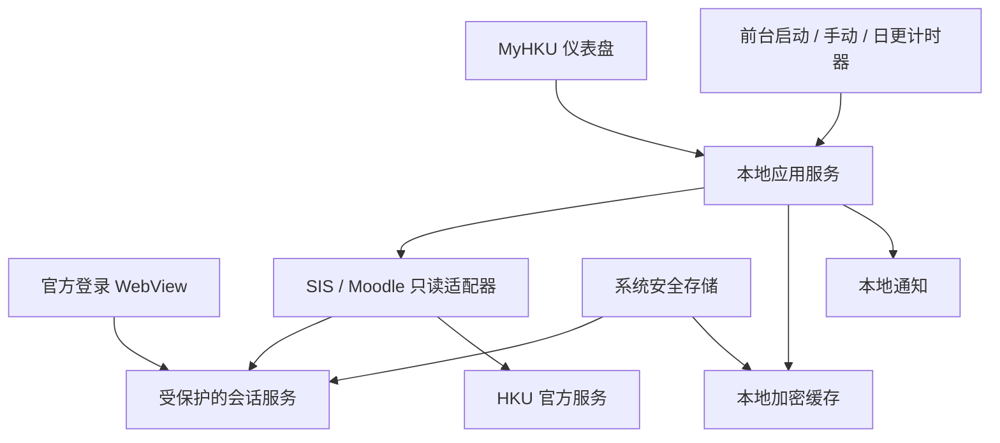

# MyHKU 技术方案与实施顺序

日期：2026-09-09。依据：[首版需求规格](product-spec.md)。当前仓库已包含可运行的 React/Vite 仪表盘、开发用本地 bridge 和 Chrome 页面连接器；Windows/macOS/Android 原生 WebView、安全存储与安装包仍按下文计划实施。

## 1. 架构方向

当前仓库的可运行实现采用 React/TypeScript 仪表盘、Electron Windows/macOS 壳和 Android 原生 WebView；Node bridge/CDP 连接器用于桌面实机验证，Android 使用 AndroidX Keystore 加密本地规范化快照。Tauri 2 + Rust 仍可作为后续替代壳，但不是当前运行入口。这里的“原生”指独立桌面/移动应用体验，UI 实现采用 Web 技术。

在实现原生层前，仍需通过三端登录、会话保护与前台数据获取验证。Tauri 在 Windows 使用 WebView2、macOS 使用 WKWebView、Android 使用系统 WebView；三端 Cookie 与生命周期行为不能假设相同。

备选为 Flutter 加适合三端的 WebView 适配。如果 Tauri 的 Android 会话或原生调度集成成本过高，再根据验证结果比较；Flutter 同样不能消除学校 SSO 与系统后台限制。Electron 单独无法覆盖 Android，因此不作为统一三端方案。

没有自建云端后端。下载用户选择的资料仍会访问 HKU 官方服务。

## 2. 模块划分

| 模块 | 职责 |
| --- | --- |
| 应用界面 | 首页、周课表、课程与课程详情、待办、资料下载、连接状态与设置 |
| 会话服务 | 站点状态检查、官方登录生命周期、受保护的秘密存储、注销和失效通知 |
| SIS 适配器 | 获取当前学期课表并规范化课程日期、时间、地点、教师 |
| Moodle 适配器 | 课程、公告、作业、完成状态、成绩与资料元数据 |
| 本地数据库 | 缓存、同步时间、内容版本、提醒去重和计划 |
| 同步协调器 | 串行化同一账号的刷新、退避重试、部分失败处理、差异检测 |
| 平台服务 | 下载、文件打开、系统安全存储与通知 |

建议使用 SQLite 保存规范化数据；敏感内容通过受审查的加密方案存储，主密钥由系统安全存储保护。具体 SQLite 加密库和平台依赖在构建验证后锁定，不自行设计密码算法。

## 3. 登录与安全存储

当前 UI 已配置官方入口：Portal/SIS 从 `https://studentportal.hku.hk/` 开始（学校会继续跳转 Microsoft Entra OIDC），Moodle 使用 `https://moodle.hku.hk/login/index.php?authCAS=CAS`。前端的“官方登录”按钮只打开这些地址并记录“等待完成登录”；“检查连接”调用可选的本地桥接接口，不尝试在浏览器中抓取或模拟 SSO。

浏览器预览通过 `VITE_HKU_BRIDGE_URL` 连接原生桥接服务。桥接暴露 `GET /api/session/{site}` 这一最小状态接口，真实的 WebView 会话、安全存储和 SIS/Moodle 只读适配器属于原生层；未配置桥接时真实模式必须显示不可用原因。

- 登录页面通过受限制的独立远程 WebView 显示，本地仪表盘使用自身上下文；学校网页没有文件系统、数据库、密钥或任意 Rust 命令的调用权限。
- SSO 所需站点会话按实际登录链组织，确保必要跳转可共享会话，同时限制不相关导航。允许域列表依据观察到的官方认证链配置。
- 学校登录密码由用户交给官方页面。MyHKU 不读取或保存密码，不自动填充密码。
- 应用持有的 Cookie/Token 等秘密只由受限制的会话服务访问，不返回仪表盘 JavaScript，也不写入日志。
- Windows/macOS 用系统安全存储保护应用密钥；Android Keystore 持有密钥，以密文保存应用需要的秘密。
- 系统 WebView 自身的 Cookie 数据库受浏览器引擎控制，需验证其磁盘保护、Profile 隔离、退出清理及恢复机制。“密钥放进钥匙串”不等于“全部浏览器缓存加密”。
- 若平台默认存储不能满足已确认的保护目标，应在完整实现前解决保护和会话恢复方式，或明确提出剩余限制，不能静默降级。
- 只有平台支持且遵守 Cookie 的域、路径、安全属性及有效期时，才能在 WebView 与后台 HTTP 层之间共享认证材料；不延长服务器会话，不将一个站点的 Cookie 广泛发送到其他域。

状态按站点独立维护：未登录、检查中、有效、已过期、网络错误。网络错误不应触发清除会话；后台过期仅提醒，用户回到前台后完成交互认证。

若学校不支持内嵌登录，必须先确认是否有官方支持的系统浏览器授权回调或其他集成方式。仅在系统浏览器里登录不会自动向应用提供 Cookie；不能把这一做法描述成已经可用的替代方案。

## 4. 数据获取与规范化

采用以下顺序，并逐项验证当前账号权限：可用的官方只读接口/导出、已登录网页实际使用且可授权访问的只读请求、必要时的受控页面 DOM 解析。

不预设 HKU 已开放可供第三方应用使用的 SIS API 或 Moodle Web Service Token。适配器负责认证、解析和错误归类，UI 只依赖规范化数据。

最小数据对象：

- Course：来源、来源 ID、名称、代码（若有）、学期。
- ClassMeeting：来源 ID、课程、日期/重复规则、开始/结束时间、时区、地点、教师。
- Assignment：来源 ID、课程、标题、截止时间、原站完成状态、详情链接。
- Announcement / Grade / Resource：来源 ID、课程、标题与来源可见字段。
- SyncRun / NotificationRecord：来源、成功时间、错误类别、基线/差异版本、去重键。

字段缺失、确实为空、权限不足、解析失败必须区分。同步失败不覆盖缓存；成功后原子更新对应数据集再计算差异。页面结构变化要报告“需要更新适配器”，不能返回虚假的空列表。

遇到会改变 Moodle 已读或完成状态的访问行为时，改用只读来源；必要时将能力标记为不可用，不能通过打开页面抓取而暗中改变用户数据。

## 5. 前台同步和通知

首版不要求应用关闭后持续同步。应用启动时执行一次刷新，用户可随时点击手动刷新；应用持续打开时按默认每天一次刷新。完全退出、休眠或断网期间不执行同步；恢复或重新打开后再刷新，并避免积压通知轰炸。

Android 首版只在应用前台执行上述刷新，不要求 WorkManager 或其他常驻后台任务。若后续要支持关闭应用后的同步，再单独验证原生调度和无需可见 WebView 的数据接口；不能依赖后台弹出 WebView 或完成 MFA。

日更刷新以应用持续运行和系统可用为前提；操作系统休眠、应用被强制停止或网络不可用时，刷新会延后到下一次前台机会。

新数据通知与已知截止时间的本地提醒分开处理。对已同步的截止时间，可使用平台支持的本地提醒机制；具体准点程度、授权要求和应用退出后的表现需逐平台验证。截止时间或作业状态更新后取消旧提醒并重新安排。

## 6. 实施顺序与验证门槛

1. **三端可行性原型**：验证官方 SSO/MFA、跨站会话、重启恢复、会话失效、磁盘保护和注销清理；分别获取一份真实课表和一个 Moodle 课程的数据。用户在官方页面亲自登录。
2. **刷新验证**：验证应用启动、手动刷新和持续打开时的日更计时器；覆盖休眠、网络切换、离线和过期会话。桌面和 Android 分别验证通知权限与点击跳转。
3. **应用骨架**：建立共享数据模型、权限边界、安全存储、数据库和平台插件。先用明确标注的模拟数据搭建界面。
4. **课表与 Moodle**：接入只读适配器、周视图、课程资料下载、待办和成绩，补齐缓存与错误状态。
5. **通知与安装包**：差异去重、截止提醒、设置、账号清理，以及三端打包和实机验收。

每一步的验证证据对应具体平台；在本机 Windows 上通过不等于 macOS 或 Android 通过。macOS 构建与签名需要 macOS 环境，Android 需要 SDK 及模拟器/实机。发布商店和配置签名证书属于后续分发工作。

## 7. 验证策略

- 用脱敏固定样例验证 SIS/Moodle 解析、周次/时区处理、缺失字段和 HTML 改版检测。
- 对失效会话、离线恢复、局部同步失败、首次同步基线和通知去重做行为测试。
- 使用真实平台验证登录持久化、WebView 存储、通知权限、下载打开和账号清理。
- 不将真实 Cookie、密码、成绩页面或可识别的抓取样本提交到仓库。

## 8. 已查阅的官方技术资料

以下用于支持候选方案，不能替代 HKU 及实机验证。查阅日期：2026-09-09。

- [Tauri WebView versions](https://v2.tauri.app/reference/webview-versions/)：三端底层 WebView 差异。
- [Tauri notification plugin](https://v2.tauri.app/plugin/notification/)：平台通知能力与权限；Windows 实际通知体验需通过安装后的应用验证。
- [Android WorkManager](https://developer.android.com/topic/libraries/architecture/workmanager)：持久后台任务、周期任务及省电调度限制。

## 9. HKU 公开入口实测（2026-09-09）

本节记录公开只读请求的结果，不表示已完成真实账号同步；真实课表、Moodle 课程及成绩仍需由用户在官方页面登录后在实机验证。

- Moodle 根路径 `/` 与 `/index.php` 返回 `303` 到 `https://moodle.hku.hk/login/index.php`。登录页的 “HKU Portal User” 链接为 `https://moodle.hku.hk/login/index.php?authCAS=CAS`，该地址 `302` 到 `https://hkuportal.hku.hk/cas/login?service=<moodle-authCAS-url>`。CAS 未认证请求继续经 `/cas/aad` 返回登录页；应用必须让用户在官方登录界面完成整个 SSO/MFA 链。
- SSO 成功后的 CAS service ticket 是一次性短期凭证，应让官方 WebView 自动跟随回调到 Moodle 以建立 `MoodleSession`；桥接层不得记录、复用或自行拼接 ticket。
- 公开响应显示 Moodle 创建 `MoodleSession`（`Secure; HttpOnly; Path=/`），CAS 创建 `JSESSIONID`（`Secure; HttpOnly; Path=/cas`）。这些 Cookie 仅供原生会话容器管理，不能复制到前端存储或日志；名称和属性可能随站点配置变化。
- Moodle 登录/业务响应带 `X-Frame-Options: SAMEORIGIN`，未返回 `Access-Control-Allow-Origin`；Portal 页面同样带 `X-Frame-Options: SAMEORIGIN`。因此本地前端页面不能依赖跨域 iframe 或直接 `fetch` HKU HTML。
- Moodle `/webservice/rest/server.php` 公网可达，但未提供 token 时返回 `invalidtoken`；`/login/token.php` 无参数返回 `missingparam`。不能假设学校已为第三方应用开放 Web Service，需在登录后实测管理员配置或用户 token。
- `studentportal.hku.hk` 未登录时跳到 `/en-US/Account/Login/ExternalLogin`，随后进入 Microsoft Entra ID（OIDC）授权：租户 `e80d8e75-52b9-4839-a358-87abb93b3567`、回调 `https://studentportal.hku.hk/signin-openid_1`、`response_type=id_token`、`scope=openid profile`、`response_mode=form_post`。这些参数只用于识别公开认证链，客户端不模拟登录或保存密码。

### 对 live bridge 的影响

跨域策略和站点 Cookie 使纯 React/Vite 浏览器页面无法可靠读取登录后的 Moodle/SIS DOM。需要桌面/原生实现提供受限的 WebView（WebView2/WKWebView/Android WebView）及同一站点 Cookie 容器：用户在官方 WebView 登录后，由原生层/本地 Rust bridge 以该容器发起同源只读请求或提取 DOM，再把规范化数据传给 UI。若目标 WebView 与数据请求上下文不能共享 Cookie，须保留每站点会话并分别检查状态。适配器应优先使用经实机确认的官方导出或只读 Web Service，其次使用页面内部只读 AJAX，最后才做带结构检测的 DOM 解析；接口不可用或页面改版时返回明确错误，不得以空数据冒充成功。

### 桌面开发连接器（Chrome DevTools Protocol）

仓库中的 `bridge/cdp.mjs` 提供一个可运行的桌面连接器，用于在原生壳层完成之前验证真实账号链路。它用 Node 22 内置 `WebSocket` 连接一个带独立持久化 profile 的可见 Chrome，打开 Moodle 和 Student Portal 官方入口，等待用户亲自完成 SSO/MFA，然后在允许的 HKU 页面上执行与扩展相同的只读 DOM 适配器，并将规范化数据写入本地 bridge。连接器只保留页面的可见字段；不会读取密码值、Cookie、localStorage、Authorization header、原始 HTML 或认证 URL 查询参数。`--once` 用于一次性验收，默认运行期间仅检查登录状态，已登录页面按日刷新。

这条 CDP 路径不会尝试接管用户的普通 Chrome profile；默认 profile 位于 `.myhku/chrome-profile`，可用 `--profile` 指定。需要连接已由用户用远程调试参数启动的浏览器时使用 `--no-launch --port <n>`。正式桌面应用由 Electron/WebView 使用自身受限会话容器；CDP 连接器作为开发和实机验证工具，不能替代平台的系统安全存储实现。
